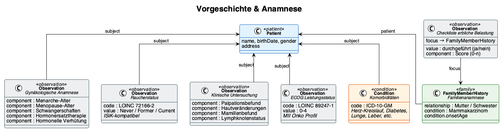

# Vorgeschichte & Anamnese - Kerndatensatz Senologie v0.1.0

* [**Table of Contents**](toc.md)
* [**Datenmodell**](datenmodell.md)
* **Vorgeschichte & Anamnese**

## Vorgeschichte & Anamnese

# Vorgeschichte & Anamnese

Inhalt folgt.

## Zugehörige Ressourcen

| | |
| :--- | :--- |
| Profil | [Senologie_Gynaekologische_Anamnese](StructureDefinition-senologie-gynaekologische-anamnese.md) |
| Profil | [Senologie_Familienanamnese](StructureDefinition-senologie-familienanamnese.md) |
| Profil | [Senologie_Klinische_Untersuchung](StructureDefinition-senologie-klinische-untersuchung.md) |
| Profil | [Senologie_Checkliste_Erbliche_Belastung](StructureDefinition-senologie-checkliste-erbliche-belastung.md) |
| Questionnaire | [Erstanamnese](Questionnaire-senologie-erstanamnese.md) |
| Questionnaire | [Klinische Untersuchung](Questionnaire-senologie-klinische-untersuchung.md) |
| Beispiel | [Fall 1 — Gynäkologische Anamnese](Observation-Fall1-Gynaekologische-Anamnese.md) |
| Beispiel | [Fall 1 — Familienanamnese](FamilyMemberHistory-Fall1-Familienanamnese.md) |
| Beispiel | [Fall 1 — Klinische Untersuchung](Observation-Fall1-Klinische-Untersuchung.md) |

