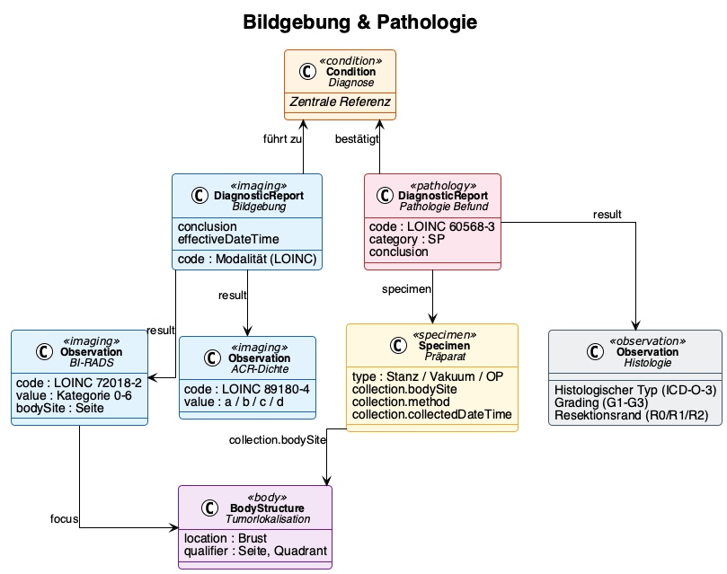

# Bildgebung & Pathologie - Kerndatensatz Senologie v0.1.0

* [**Table of Contents**](toc.md)
* [**Datenmodell**](datenmodell.md)
* **Bildgebung & Pathologie**

## Bildgebung & Pathologie

# Bildgebung & Pathologie

## Strukturierte Befunde in der Senologie

Bildgebung und Pathologie liefern die diagnostischen Grundlagen für Staging und Therapieentscheidung. Obwohl beide Disziplinen mit etablierten Klassifikationssystemen arbeiten (BI-RADS, TNM, Allred-Score), kommen ihre Ergebnisse aus spezialisierten Subsystemen, die Befunde bislang selten in einem einheitlich strukturierten, maschinenlesbaren Format bereitstellen. Perspektivisch können technische Standards wie der HL7 Europe Imaging Study Report oder die MII Pathologie-Spezifikation hier eine Brücke schaffen — vorausgesetzt, die fachlichen Vorgaben zu Inhalten und Terminologien werden durch die Fachgesellschaften getragen.

Bis dahin übernimmt die klinische Dokumentation die Aufgabe der Strukturierung: Kliniker wählen standardisierte Kategorien aus, erfassen definierte Datenpunkte und ermöglichen so die Überführung in ein interoperables Datenmodell.

## Bildgebung

### Modalitäten und Kodierung

| | | | |
| :--- | :--- | :--- | :--- |
| Mammographie bilateral | Screening, Abklärung | 24606-6 | 71651007 |
| Sonographie bilateral | Ergänzend, interventionell | 24590-2 | 16310003 |
| MRT Mamma | Präoperativ, Hochrisiko | 24589-4 | 241615005 |
| Skelettszintigraphie | Staging Fernmetastasen | 39638-7 | 44491008 |
| CT Thorax/Abdomen | Staging | 24627-2 | 77477000 |

### Befundstruktur

Bildgebungsbefunde werden als `DiagnosticReport` mit zugehörigen `Observations` abgebildet:

* **DiagnosticReport**: Gesamtbefund mit Conclusion, Modalität, Datum
* **Observation (BI-RADS)**: Bewertungskategorie 0–6 (LOINC 72018-2, ACR BI-RADS ValueSet)
* **Observation (ACR-Dichte)**: Brustdichte a–d (LOINC 89180-4)
* **Observation (Herdbefund)**: Beschreibung auffälliger Läsionen mit Größe, Form, Begrenzung

Die Lokalisation wird über eine `BodyStructure`-Ressource abgebildet, die Seite (links/rechts), Quadrant und ggf. Uhrzeigerposition kodiert. Bei bilateralen Untersuchungen muss eindeutig unterscheidbar sein, welcher Befund sich auf welche Brust bezieht.

## Pathologie

### Untersuchungstypen

| | | | |
| :--- | :--- | :--- | :--- |
| Stanzbiopsie | Core-Needle | 122737001 | Präoperativ, Diagnosesicherung |
| Vakuumbiopsie | Vakuum-assistiert | 450614001 | B3-Läsionen, Mikrokalk |
| OP-Präparat | Exzidat / Mastektomie | 122548005 | Postoperativ, definitive Histologie |
| Nachresektion | Nachresektat | 122548005 | Bei R1-Situation |

### Befundstruktur

Der pathologische Befund wird als `DiagnosticReport` (Profil: MII Pathologie Report) abgebildet:

| | | |
| :--- | :--- | :--- |
| Histologischer Typ | Observation.code | ICD-O-3 Morphologie |
| Grading | Observation.value | LOINC 33732-9, Nottingham G1–G3 |
| ER-Rezeptor | Observation (MII Onko) | LOINC 16112-5, IRS 0–12 |
| PR-Rezeptor | Observation (MII Onko) | LOINC 16113-3, IRS 0–12 |
| HER2-Status | Observation (MII Onko) | LOINC 48676-1, IHC 0/1+/2+/3+ |
| Ki-67 | Observation | LOINC 29593-1, Prozent |
| Resektionsrand | Observation | R0/R1/R2/RX (MII Onko Residualstatus) |

### Diagnostischer Pfad

Der typische Ablauf von der Bildgebung bis zur Therapieentscheidung:

1. **Bildgebung**identifiziert auffälligen Befund → BI-RADS 4/5
1. **Biopsie**wird durchgeführt → Specimen entsteht
1. **Pathologie-Befund**liefert Typing, Grading, Rezeptorstatus → Condition wird bestätigt/spezifiziert
1. **Staging-Komplettierung**→ Fernmetastasen-Ausschluss, TNM
1. **Tumorboard**entscheidet Therapie auf Basis aller Befunde

Jeder Schritt erzeugt FHIR-Ressourcen die aufeinander referenzieren: DiagnosticReport verweist auf Specimen und Observations, diese auf die Condition (Diagnose).

